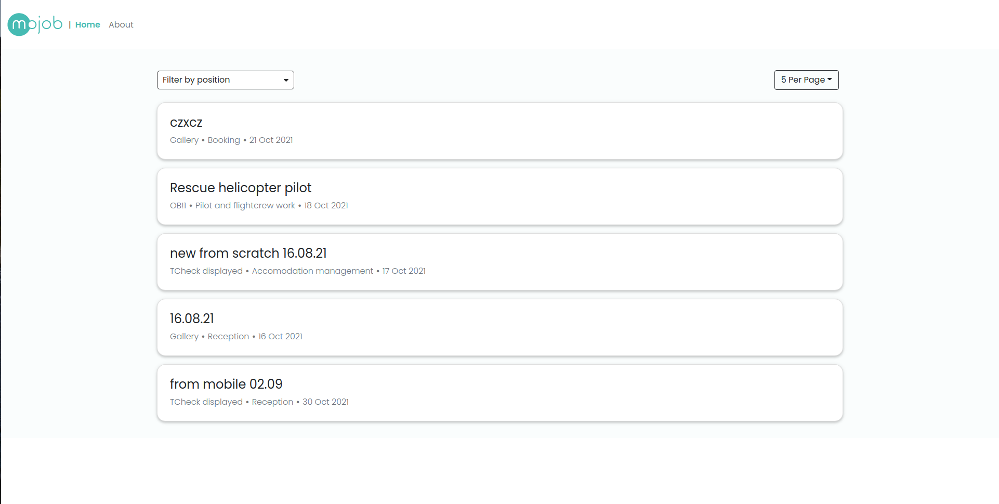
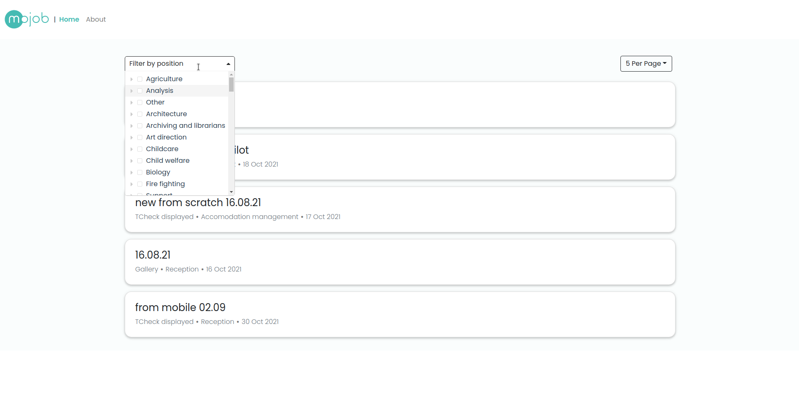
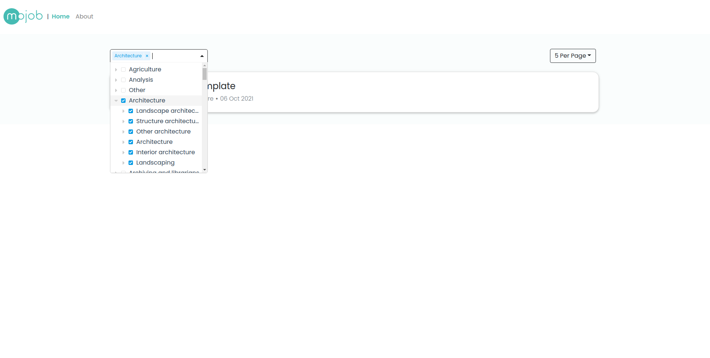
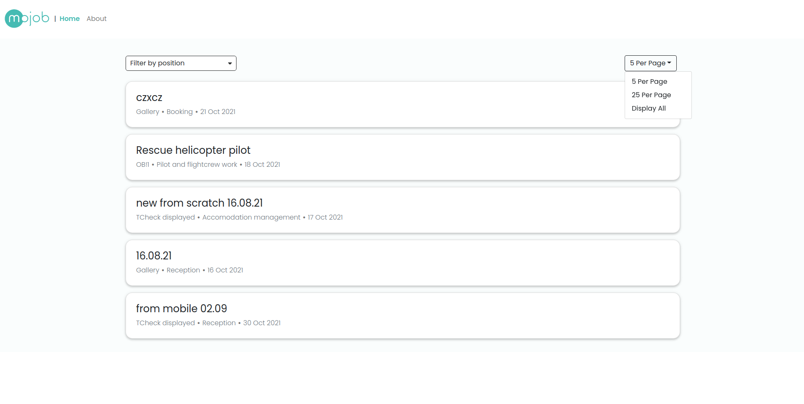
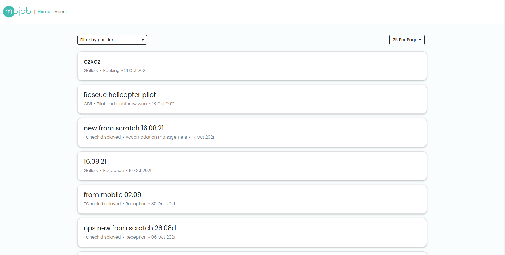

# mojob-job-feed

## The task
* fetch job listings and display them in a job feed
* create a job position function filter.

All job listings and all job locations can be fetched from Mojob public API.

## Design (Task Results)

### Design 1

No default position function filters set, and that the page size is set to 5 items per page.


### Design 2

The position function filtering selector.


### Design 3

The tree structure of the position functions and it being displayed in the position function filtering selector.


### Design 4

The pagination page size selector. "Display All" has been solved by using "use_pagination" option.


### Design 5

The text of the "<page_size> PER PAGE" changes when you select a new page size option.


## Node + NPM versions
```
Node v12.19.0 (npm v6.14.8)
```

## Project setup

### Command to install dependencies
```
npm install
```
### Command to run the development server
```
npm run serve
```

## ⚠️ 
```
I have used node version:
v12.19.0
I have used npm version:
v6.14.8
Javascript framework used:
Vue
Do you have any other comments regarding your deliverable?
I have used "bootstrap-vue", "moment", "vue-treeselect" libraries to speed up the process.
Do you have any comments/feedback about the task we gave you?
I enjoyed working on this task, I hope you will like the result.
```
